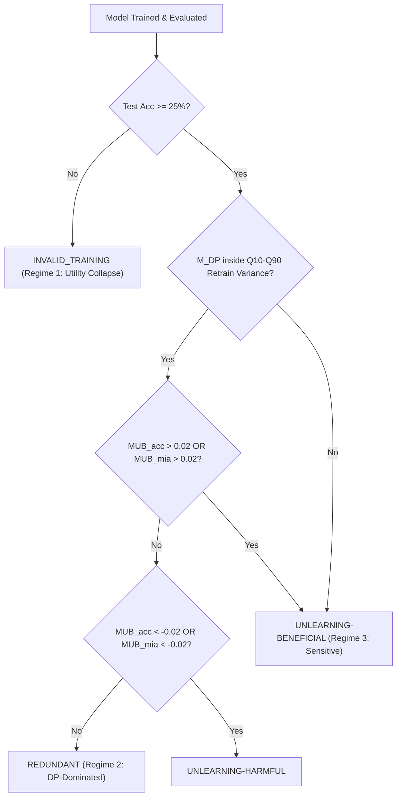

# Redundancy Frontier & Scientific Decision Framework

**Lead Research Engineer Report — DP-ForgetBench**  
**Core Scientific Question:** *“When is explicit client unlearning redundant under client-level differentially private federated learning?”*  

---

## 1. The Three Scientific Regimes

A defensible unlearning benchmark must distinguish between models that are truly private and models that simply failed to learn. DP-ForgetBench defines three distinct regimes:

```
+-----------------------------------------------------------------------------+
|                               REGIME SPECTRUM                               |
+-----------------------------------------------------------------------------+
|  REGIME 1: UTILITY COLLAPSE                                                 |
|  - Accuracy < 25% (near random chance on CIFAR-10)                          |
|  - Validity Gate: INVALID_TRAINING                                          |
|  - Scientific Status: Unlearning claims are invalid / vacuously redundant   |
+-----------------------------------------------------------------------------+
|  REGIME 2: DP-DOMINATED REDUNDANCY                                          |
|  - Accuracy >= 40% (Model learns the task successfully)                     |
|  - Deletion effect is masked by client-level DP noise & retrain variance    |
|  - rho = E_delete / E_retrain << 1                                          |
|  - Scientific Status: True redundancy (DP-only matches exact retrain)       |
+-----------------------------------------------------------------------------+
|  REGIME 3: UNLEARNING-SENSITIVE                                             |
|  - Accuracy >= 40% (Model learns the task successfully)                     |
|  - Deletion effect exceeds natural retraining variability                   |
|  - rho = E_delete / E_retrain >> 1                                          |
|  - Scientific Status: Explicit unlearning (FedEraser/FT) is beneficial       |
+-----------------------------------------------------------------------------+
```

---

## 2. Upstream Validity Gating: Preventing False Claims

Previous literature often reports near-zero attack advantage under strong DP as evidence of unlearning redundancy, without auditing whether the model actually learned the task.

### The Upstream Rule:
$$\text{If } \text{Accuracy}(M_{target}) < \text{Chance} + 0.15 \implies \mathbf{INVALID\_TRAINING}$$

When a cell is flagged as `INVALID_TRAINING`:
- No unlearning algorithm can be claimed as `REDUNDANT`.
- The cell is categorized as **Utility Collapse**.
- Unlearning evaluation is halted for that parameter cell until training hyperparameters are repaired.

---

## 3. Four-Way Scientific Classification Hierarchy

For cells that pass the upstream validity gate (`VALID`), methods are classified into four mutually exclusive categories based on the **Marginal Unlearning Benefit (MUB)**:



### Definitions:
1. **`REDUNDANT`**:
   - The pre-deletion model ($M_{DP}$) falls within the natural variance bounds $[Q_{10}, Q_{90}]$ of the multi-seed retrain ensemble ($M_R$).
   - Explicit unlearning ($M_U$) provides no statistically significant advantage ($|MUB| \le 0.02$).
2. **`UNLEARNING-BENEFICIAL`**:
   - Explicit unlearning significantly improves utility ($MUB_{acc} > +0.02$) or reduces forgotten membership leakage ($MUB_{MIA} > +0.02$) toward $M_R$.
3. **`UNLEARNING-HARMFUL`**:
   - Unlearning causes catastrophic degradation ($MUB_{acc} < -0.02$) or exacerbates retained-set membership leakage.
4. **`INCONCLUSIVE`**:
   - Bootstrap 95% confidence intervals overlap zero and natural retrain variance is too high to establish statistical separation.

---

## 4. Normalized Deletion-Effect Metric ($\rho$)

To quantitatively measure whether a client deletion has an observable effect relative to ordinary retraining noise, we define the dimensionless ratio:

$$\rho = \frac{E_{delete}}{E_{retrain}} = \frac{d(M_{full}, M_R)}{Q_{90}[d(M_R^i, M_R^j)]}$$

where $d(M_A, M_B)$ is the predictive Jensen-Shannon divergence over test data:
- $E_{delete}$: Divergence between the un-deleted full model and the exact retrain model.
- $E_{retrain}$: 90th percentile of divergence between two independently trained retrain models initialized with different random seeds.

### Scientific Interpretation of $\rho$:
- **$\rho \ll 1$ (e.g. $\rho < 0.5$)**: Deletion effect is tiny compared to natural seed variability. Doing nothing is empirically indistinguishable from full retraining.
- **$\rho \approx 1$**: Transition boundary. Deletion effect is comparable to natural seed variability.
- **$\rho \gg 1$ (e.g. $\rho > 2.0$)**: Deletion has a massive effect that easily exceeds retraining noise. Explicit unlearning is necessary.
